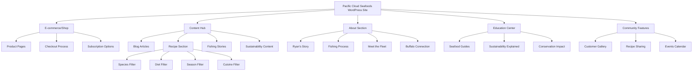

# Pacific Cloud Seafoods: WordPress Content-Driven Website Plan

## Executive Summary
This plan outlines the development of a content-driven WordPress version of the Pacific Cloud Seafoods Shopify store. The goal is to create a platform that not only sells sustainable seafood products but also educates consumers about sustainable fishing practices, shares the story of Ryan Horwath and his mission, and builds a community around responsible seafood consumption.

## Brand & Story Analysis

### Core Brand Elements
- **Founder Story**: Ryan Horwath's journey as a fisherman and entrepreneur
- **Mission**: Bringing sustainably-caught seafood to consumers in the Buffalo area
- **Values**: Sustainability, transparency, quality, ocean conservation
- **Unique Selling Proposition**: Direct connection between small fishing boats and consumers

### Competitive Analysis
Based on research of Wild Alaskan Company and Sitka Seafood Market:
1. **Wild Alaskan Company**: Focuses on subscription model, extensive educational content
2. **Sitka Seafood Market**: Emphasizes "sushi-grade" quality, visual appeal, and subscription options
3. **Pacific Cloud Seafoods**: Can differentiate by highlighting the local Buffalo connection and Ryan's personal story

## WordPress Website Structure

### Technical Setup
1. **Platform**: WordPress with WooCommerce integration
2. **Theme**: Custom AI-generated theme tailored to seafood sustainability aesthetics
3. **Hosting**: Hostinger (affordable with good WordPress optimization)
4. **Key Plugins**:
   - WooCommerce
   - Yoast SEO
   - WPForms
   - Elementor Pro (for visual page building)
   - ShortPixel (image optimization)
   - WP Rocket (caching and performance)

### Site Architecture
1. **Homepage**
   - Hero section featuring Ryan's story and mission
   - Featured products carousel
   - "Our Impact" section with sustainability metrics
   - Newsletter signup with seafood recipe incentive
   - Latest blog posts/content

2. **Shop Pages**
   - Product categories organized by fish type
   - Filterable by catch method, origin, and preparation options
   - Each product includes "The Story Behind This Fish" section
   - Clear sustainability certifications and ratings

3. **Content Hub (Blog)**
   - Categories: Recipes, Fishing Stories, Sustainability, Buffalo Local
   - Regular publishing schedule (2-3 posts per week)
   - Guest contributions from chefs, fishermen, and conservation experts

4. **About Pages**
   - Ryan's personal journey
   - The fishing process visual journey
   - Meet the fleet (profiles of partner fishing boats)
   - Buffalo connection and local impact
   - Sustainability commitments and certifications

5. **Education Center**
   - Seafood preparation guides
   - Fishing methods explained
   - Sustainability certification glossary
   - "Why it Matters" conservation impact

6. **Community Features**
   - Customer photo gallery
   - Recipe sharing platform
   - Q&A with Ryan
   - Upcoming local events and markets

## Content Strategy

### Core Content Pillars
1. **The Fisher's Perspective**: Behind-the-scenes of sustainable fishing
2. **From Ocean to Plate**: Supply chain transparency
3. **Cooking with Confidence**: Seafood preparation education
4. **Conservation Impact**: How buying choices affect oceans
5. **Buffalo Food Scene**: Local connections and partnerships

### Blog Content Plan
The blog will serve as the central hub for storytelling, education, and community building.

#### Blog Categories
1. **Fishing Life**: Stories from the boats, fishing methods, challenges, seasonal variations
2. **Sustainability**: Ocean health, certification explanations, conservation efforts, innovations
3. **Local Impact**: Buffalo food scene, partnerships, events, community initiatives
4. **Seafood Education**: Species guides, handling tips, freezing techniques, quality indicators
5. **Company Updates**: New offerings, milestones, team stories, behind-the-scenes

#### Blog Content Calendar (First 3 Months)
| Week | Primary Post | Secondary Post | Social Focus |
|------|-------------|----------------|--------------|
| 1 | "Meet Ryan: From Alaskan Waters to Buffalo Tables" | "Understanding MSC Certification" | Founder story |
| 2 | "The Art of Jig Fishing for Sustainable Cod" | "3 Ways to Tell if Your Salmon is Truly Wild" | Fishing methods |
| 3 | "How Pacific Cloud is Supporting Buffalo Food Security" | "Seafood Freezing Guide: Maintain Peak Freshness" | Local impact |
| 4 | "Winter Fishing in Alaska: Challenges and Rewards" | "Why Fish Origin Matters for Your Health" | Seasonal fishing |
| 5 | "Partner Profile: Meet the Captain of F/V Northern Light" | "How to Break Down a Whole Salmon" | Meet the fleet |
| 6 | "The Buffalo-Alaska Connection: Building Community Through Food" | "What Makes Alaskan Waters Unique" | Community building |
| 7 | "Seafood Carbon Footprint: How Small Boats Make a Difference" | "Cooking Fish on the Bone: Pro Tips" | Sustainability |
| 8 | "Seasonal Spotlight: Spring Halibut Season Begins" | "Fish Oil Benefits: Wild vs. Farmed Sources" | Seasonal products |
| 9 | "From Boat to Box: Following Your Fish's Journey" | "How to Spot Greenwashing in Seafood Marketing" | Transparency |
| 10 | "Local Chef Series: Chef Maria's Pacific Cloud Creations" | "Seafood Smoking Techniques for Beginners" | Culinary focus |
| 11 | "Ocean Acidification: Why It Matters for Your Seafood" | "Kid-Friendly Fish Recipes That Actually Work" | Conservation |
| 12 | "Year One in Buffalo: What We've Learned" | "Summer Grilling Guide for Seafood" | Company milestone |

#### Blog Post Structure
Each blog post should include:
- Engaging header image
- Brief introduction with key takeaway
- Subheadings for scannable content
- Personal stories or anecdotes where relevant
- Practical tips or actionable information
- Call to action (shop related products, share, comment)
- Related posts section
- Author bio (especially for guest posts)

### Recipe Section Plan
The recipe section will be a searchable, filterable resource that inspires customers and provides confidence in preparing seafood.

#### Recipe Organization System
The recipe section will feature a robust filtering system with the following taxonomies:

1. **Species Filter**
   - Salmon (King, Sockeye, Coho)
   - Halibut
   - Cod
   - Rockfish
   - Sablefish/Black Cod
   - Scallops
   - Spot Prawns
   - Other seasonal offerings

2. **Diet Filter**
   - Keto/Low-Carb
   - Paleo
   - Gluten-Free
   - Dairy-Free
   - Mediterranean
   - High-Protein
   - Kid-Friendly
   - Quick & Easy (under 30 min)

3. **Season Filter**
   - Spring
   - Summer
   - Fall
   - Winter
   - Holiday Specials

4. **Cuisine Filter**
   - American
   - Italian
   - Asian (Japanese, Chinese, Thai, etc.)
   - Mediterranean
   - Latin American
   - Fusion
   - Buffalo Local Specialties

#### Recipe Content Structure
Each recipe will include:
- Preparation time, cooking time, servings
- Difficulty level (beginner to advanced)
- Ingredient list with product links
- Step-by-step instructions with photos
- Nutritional information
- Wine/beer pairing suggestions
- Substitution options
- Storage and leftover usage tips
- User rating system
- Comment section for questions and variations

#### Initial Recipe Content Plan (First 20 Recipes)
1. "Perfect Pan-Seared Sockeye Salmon with Lemon-Dill Sauce"
2. "Buffalo-Style Salmon Fish Fry with Blue Cheese Slaw"
3. "Grilled Halibut Steaks with Chimichurri"
4. "Asian-Inspired Cod Packets with Bok Choy"
5. "5-Ingredient Rockfish Tacos"
6. "Sablefish Misoyaki (Black Cod with Miso Glaze)"
7. "Seared Scallops with Bacon Jam"
8. "Spot Prawn Pasta with White Wine and Garlic"
9. "Sheet Pan Salmon with Seasonal Vegetables"
10. "Smoked Salmon Breakfast Bowl"
11. "Halibut Ceviche with Avocado and Citrus"
12. "Cod Fish Cakes with Homemade Tartar Sauce"
13. "Rockfish Chowder (Dairy-Free Option)"
14. "Keto Salmon with Cauliflower Rice Pilaf"
15. "Kid-Approved Fish Sticks (Healthier Version)"
16. "Holiday Seafood Stew"
17. "Summer Grilled Salmon with Peach Salsa"
18. "Buffalo Wing-Inspired Cod Bites"
19. "Sablefish Ramen Bowl"
20. "Mediterranean Halibut with Olives and Tomatoes"

#### Recipe Development Resources
- Collaborate with local Buffalo chefs for specialty recipes
- Feature customer-submitted recipes (with testing and verification)
- Partner with nutritionists for health-focused recipes
- Seasonal content aligned with fishing seasons and local produce availability

### Visual Content
- "Meet the Fleet" photo essays
- Infographics on fishing methods
- Step-by-step recipe videos
- Before/after conservation efforts

### Interactive Elements
- Seafood selector tool
- Sustainability quiz
- Recipe finder by dietary preference
- "Where's Your Fish From?" map

### Email Content
- Weekly catch updates
- Seasonal recipes
- Conservation news
- Customer spotlights

### Content Calendar Structure
- **Weekly**: Recipe post, fishing update
- **Bi-Weekly**: Sustainability feature, Buffalo local connection
- **Monthly**: In-depth fisher profile, conservation impact report
- **Quarterly**: Seasonal eating guide, sustainability metrics update

## E-commerce Integration

### Product Presentation
1. Each product page should include:
   - Professional photography
   - Catch date and location
   - Fishing method used
   - Sustainability rating
   - Chef-developed recipes
   - Customer reviews

2. Special features:
   - QR code linking to fishing boat story
   - Preparation video tutorials
   - "Pairs well with" suggestions

### Purchase Options
1. **One-time purchases**
2. **Subscription boxes** (similar to Wild Alaskan Company)
3. **Build-your-own variety packs**
4. **Gift options**

### Post-Purchase Experience
1. Product-specific preparation instructions via email
2. Recipe suggestions based on purchase
3. Survey for feedback on quality and freshness
4. Loyalty program with sustainability impact tracking

## Marketing Integration

### SEO Strategy
1. **Primary Keywords**:
   - Sustainable seafood Buffalo
   - Wild-caught Alaskan salmon
   - Direct from fisherman seafood
   - Seafood subscription Buffalo

2. **Content Clusters**:
   - Sustainable fishing methods
   - Buffalo seafood market
   - Wild vs. farmed fish
   - Seasonal seafood guide

### Social Media Integration
1. **Instagram**: Behind-the-scenes, recipe videos, customer features
2. **Facebook**: Community building, events, longer content
3. **Pinterest**: Recipe collections, seasonal guides
4. **YouTube**: Fishing journey, preparation tutorials, conservation stories

### Email Marketing
1. **Welcome Series**: Ryan's story, sustainability mission, first purchase incentive
2. **Weekly Catch**: New arrivals, limited availability items
3. **Content Roundup**: Best blog posts, recipes, and stories
4. **Sustainability Impact**: How customer purchases are making a difference

## Implementation Timeline

### Phase 1: Foundation (Weeks 1-4)
- WordPress and WooCommerce setup
- Theme selection and customization
- Basic product migration from Shopify
- Core pages development

### Phase 2: Content Development (Weeks 5-8)
- Content hub setup
- Initial blog posts (10-15 articles)
- Product storytelling integration
- Email templates creation

### Phase 3: Enhanced Features (Weeks 9-12)
- Interactive elements development
- Community features implementation
- Advanced product filtering
- SEO optimization

### Phase 4: Launch & Marketing (Weeks 13-16)
- Final testing and quality assurance
- Redirect setup from Shopify
- Launch promotion campaign
- Analytics setup and monitoring

## Measurement & Success Metrics

### Content Performance
- Page views and time on site
- Email open and click rates
- Social sharing metrics
- SEO ranking improvements

### Business Impact
- Conversion rate comparison (Shopify vs. WordPress)
- Average order value
- Returning customer rate
- Subscription sign-up rate

### Community Building
- User-generated content submissions
- Event participation
- Newsletter growth rate
- Social media engagement

## Budget Considerations

### One-Time Costs
- AI theme generation tools: $0-100 (depending on which AI tools you use)
- Premium plugins: $200-400 (you can reduce costs by using free alternatives)
- Professional photography: $500-1,000
- Initial content development: $500-1,500 (leveraging AI for content generation)
- Design and development: $500-2,000 (significantly reduced with AI assistance)

### Ongoing Costs
- Hostinger hosting: $5-15/month (business plans)
- Plugin maintenance: $10-30/month
- Content creation: $200-500/month (with AI assistance)
- Email marketing platform: $15-50/month
- SEO and analytics: $50-150/month

## Next Steps

1. **Set up Hostinger hosting** and install WordPress with WooCommerce
2. **Generate custom theme using AI tools** that aligns with seafood/sustainability aesthetic
   - Consider using tools like ChatGPT for design concepts, Midjourney for visual elements
   - Use AI-assisted page builders like Elementor with AI or similar tools
3. **Develop content calendar** for first 3 months (use AI to help draft initial content)
4. **Create migration plan** for existing products and customers from Shopify
5. **Begin collecting enhanced product information** (stories, sustainability metrics, etc.)
6. **Identify local partnerships** for content collaboration in Buffalo area

---

This plan combines the storytelling and educational approach of Wild Alaskan Company with the visual appeal and quality emphasis of Sitka Seafood Market, while highlighting Ryan Horwath's unique connection to both the fishing industry and the Buffalo community. The content-first approach will build authority in the sustainable seafood space while driving conversions through education and transparency.
